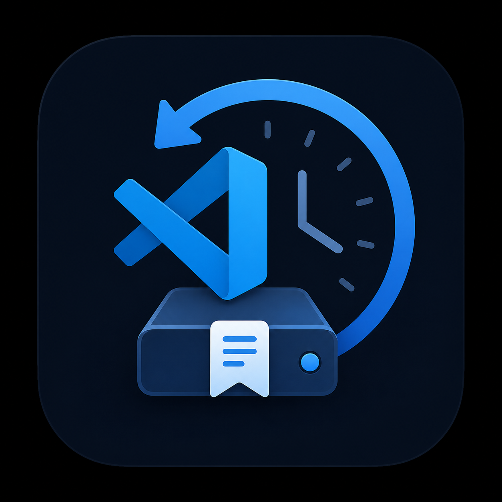

# SnapBack — VSCode Extension



Remembers up to **N** undo/redo snapshots per file and restores them across
VSCode restarts. VSCode's built-in undo history is wiped every time you close
the editor; SnapBack keeps its own parallel stack that survives.

---

## How It Works

```
File change detected
        │
        ▼
 previousContent ──► pushed to undoStack (capped at N)
                     redoStack cleared
                          │
             ┌────────────┴─────────────┐
             │                          │
           Ctrl+Z                  Ctrl+Y
          (undo)                    (redo)
             │                          │
  pop undoStack snapshot      pop redoStack snapshot
  push current ► redoStack    push current ► undoStack
  replace document text       replace document text
             │                          │
             └──────────────────────────┘
                          │
                  persist to workspaceState
                  (survives restart)
```

Every mutation to the stacks is immediately written to VSCode's
`workspaceState` (backed by SQLite), so the history is reloaded automatically
on the next launch.

---

## Commands & Keybindings

| Command | Windows | Mac | Description |
|---|---|---|---|
| `SnapBack Undo` | `Ctrl+Z` | `Cmd+Z` | Step back through persistent history |
| `SnapBack Redo` | `Ctrl+Y` | `Cmd+Shift+Z` | Step forward through persistent history |
| `Show History & Stats` | — | — | Show current stack depths |
| `Clear History for This File` | — | — | Wipe history for the active file |
| `Clear ALL Persistent History` | — | — | Wipe all persisted history |

> These keybindings **replace** VSCode's native `Ctrl+Z` / `Ctrl+Y` when the
> editor is focused. To run both systems in parallel instead, assign different
> shortcuts in `package.json` or your personal keybindings file.

---

## Configuration

```jsonc
// settings.json
{
  // Maximum undo/redo snapshots stored per file (default: 500)
  // Each snapshot is a full copy of the file text at that moment.
  // Large files × high maxHistory = more workspace storage used.
  "snapback.maxHistory": 200
}
```

---

## Getting Started

```bash
# 1. Clone the repo
cd snapback

# 2. Install dependencies
npm install

# 3. Compile
npm run compile

# 4. Open in VSCode and press F5 to launch the Extension Development Host
#    — or package it:
npm run package   # produces snapback-0.0.1.vsix
code --install-extension snapback-0.0.1.vsix
```

---

## Architecture

```
src/
├── types.ts            ← Snapshot & FileHistory interfaces
├── UndoRedoManager.ts  ← Stack logic + workspaceState persistence
└── extension.ts        ← VSCode lifecycle, listeners, commands, status bar
```

### Key design decisions

**Full-text snapshots** — each entry stores the entire document content before
a change. Simple and correct. Trade-off: large files with `maxHistory=10000`
will use significant storage. Switch to diff-based snapshots (e.g. via
`fast-diff`) when that becomes a problem.

**`isApplying` guard** — when we replace document text to apply a snapshot,
VSCode fires `onDidChangeTextDocument` again. The boolean flag ensures that
replacement isn't recorded as a new change, preventing infinite loops.

**`undoStopBefore: false, undoStopAfter: false`** — our `editor.edit()` calls
use these options so the snapshot application doesn't appear in VSCode's own
native undo stack, keeping the two systems independent.

**`workspaceState` persistence** — scoped to the current workspace, so history
for files in project A doesn't bleed into project B. If you want cross-
workspace persistence, swap `workspaceState` for `globalState` in
`UndoRedoManager._persist()` and `_loadFromStorage()`.

---

## Limitations

- History is lost if you move/rename a file (the URI key changes).
- Binary/very large files may cause storage pressure at high `maxHistory`.
- The extension activates on `onStartupFinished`; documents open *before*
  activation are seeded but changes made before activation are not recorded.
